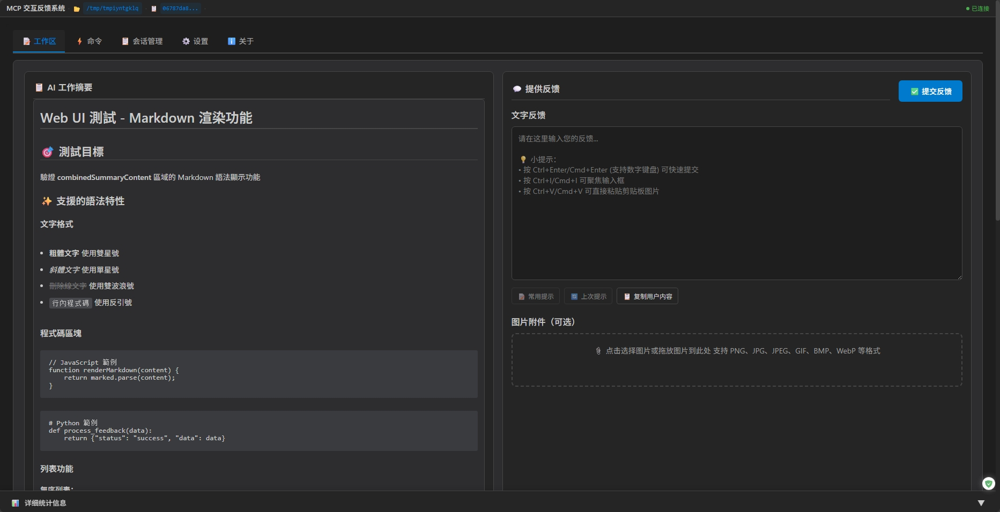
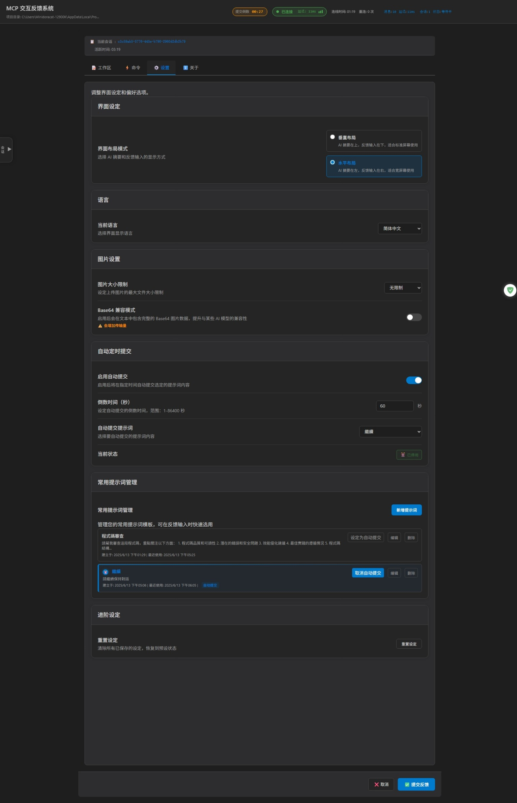

# mowan-mcp-feedback（交互反馈 MCP）

**基于：** [Fábio Ferreira](https://x.com/fabiomlferreira) 的 [interactive-feedback-mcp](https://github.com/noopstudios/interactive-feedback-mcp) ⭐ 和 [Minidoracat](https://github.com/Minidoracat) 的 [mcp-feedback-enhanced](https://github.com/Minidoracat/mcp-feedback-enhanced)
**UI 设计参考：** [sanshao85/mcp-feedback-collector](https://github.com/sanshao85/mcp-feedback-collector)

> 当前仓库为二次改造版本，已切换到你自己的 GitHub 仓库与 PyPI 发布链路，同时继续保留上游来源说明和 MIT 许可证。

## 🎯 核心概念

这是一个 [MCP 服务器](https://modelcontextprotocol.io/)，建立**反馈导向的开发工作流程**，提供 **Web UI** 界面，完美适配本地、**SSH 远程开发环境**与 **WSL (Windows Subsystem for Linux) 环境**。通过引导 AI 与用户确认而非进行推测性操作，可将多次工具调用合并为单次反馈导向请求，大幅节省平台成本并提升开发效率。

**支持平台：** [Cursor](https://www.cursor.com) | [Cline](https://cline.bot) | [Windsurf](https://windsurf.com) | [Augment](https://www.augmentcode.com) | [Trae](https://www.trae.ai)

### 🔄 工作流程
1. **AI 调用** → `mowan-mcp-feedback` 工具
2. **界面启动** → 自动打开浏览器界面
3. **智能交互** → 提示词选择、文字输入、图片上传、自动提交
4. **即时反馈** → WebSocket 连接即时传递信息给 AI
5. **会话追踪** → 自动记录会话历史与统计
6. **流程继续** → AI 根据反馈调整行为或结束任务

## 🌟 主要功能

> 说明：下文如果出现 `v2.x`，指的是上游功能最早引入的版本号；本仓库当前从 `1.0.0` 开始重新编号。

### 🌐 Web UI 界面
- **轻量级浏览器界面**：无需额外 GUI 依赖，适合各种环境
- **环境自动检测**：智能识别 SSH Remote、WSL 等特殊环境
- **跨平台支持**：Windows、macOS、Linux 全平台兼容

### 📝 智能工作流程
- **提示词管理**：常用提示词的 CRUD 操作、使用统计、智能排序
- **自动定时提交**：1-86400 秒弹性计时器，支持暂停、恢复、取消，新增暂停/开始按钮控制
- **自动执行命令**（v2.6.0）：新建会话和提交后可自动执行预设命令，提升开发效率
- **会话管理追踪**：本地文件存储、隐私控制、历史导出（支持 JSON、CSV、Markdown 格式）、即时统计、弹性超时设定
- **连接监控**：WebSocket 状态监控、自动重连、品质指示
- **AI 工作摘要 Markdown 显示**：支持丰富的 Markdown 语法渲染，包含标题、粗体、代码区块、列表、链接等格式，提升内容可读性

### 🎨 现代化体验
- **响应式设计**：适配不同屏幕尺寸，模块化 JavaScript 架构
- **音效通知**：内建多种音效、支持自定义音效上传、音量控制
- **系统通知**（v2.6.0）：重要事件（如自动提交、会话超时等）的系统级即时提醒
- **智能记忆**：输入框高度记忆、一键复制、设置持久化
- **多语言支持**：简体中文、英文、繁体中文，即时切换

### 🖼️ 图片与媒体
- **全格式支持**：PNG、JPG、JPEG、GIF、BMP、WebP
- **便捷上传**：拖拽文件、剪贴板粘贴（Ctrl+V）
- **无限制处理**：支持任意大小图片，自动智能处理

## 🌐 界面预览

### Web UI 界面

<div align="center">
  
</div>

<details>
<summary>📱 点击查看完整界面截图</summary>

<div align="center">
  
</div>

</details>

*Web UI 界面 - 提供提示词管理、自动提交、会话追踪等智能功能*

**快捷键支持**
- `Ctrl+Enter`（Windows/Linux）/ `Cmd+Enter`（macOS）：提交反馈（主键盘与数字键盘皆支持）
- `Ctrl+V`（Windows/Linux）/ `Cmd+V`（macOS）：直接粘贴剪贴板图片
- `Ctrl+I`（Windows/Linux）/ `Cmd+I`（macOS）：快速聚焦输入框 (感谢 @penn201500)

## 🚀 快速开始

### 1. 安装与测试
```bash
# 安装 uv（如果尚未安装）
pip install uv
```

### 2. 配置 MCP
**基本配置**（适合大多数用户）：
```json
{
  "mcpServers": {
    "mowan-feedback": {
      "command": "uvx",
      "args": ["mowan-mcp-feedback"],
      "timeout": 600,
      "autoApprove": ["interactive_feedback"]
    }
  }
}
```

**进阶配置**（需要自定义环境）：
```json
{
  "mcpServers": {
    "mowan-feedback": {
      "command": "uvx",
      "args": ["mowan-mcp-feedback"],
      "timeout": 600,
      "env": {
        "MCP_DEBUG": "false",
        "MCP_WEB_HOST": "127.0.0.1",
        "MCP_WEB_PORT": "8765",
        "MCP_LANGUAGE": "zh-CN"
      },
      "autoApprove": ["interactive_feedback"]
    }
  }
}
```

### 3. 快捷使用

安装并配置完成后，在 Cursor 中输入以下命令即可启动交互反馈：

```
/user-mowan-feedback/chat
```

AI 会自动调用 `interactive_feedback` 工具，打开 Web UI 并等待你的反馈。

> **提示**：为获得最佳效果，建议在 AI 助手的规则中添加：
> ```
> 注意在任务完成前根据 mowan-mcp-feedback 工具的要求进行工具调用
> ```

## ⚙️ 高级设置

### 环境变量
| 变量 | 用途 | 值 | 默认 |
|------|------|-----|------|
| `MCP_DEBUG` | 调试模式 | `true`/`false` | `false` |
| `MCP_WEB_HOST` | Web UI 主机绑定 | IP 地址或主机名 | `127.0.0.1` |
| `MCP_WEB_PORT` | Web UI 端口 | `1024-65535` | `8765` |
| `MCP_LANGUAGE` | 强制指定界面语言 | `zh-TW`/`zh-CN`/`en` | 自动检测 |

**`MCP_WEB_HOST` 说明**：
- `127.0.0.1`（默认）：仅本地访问，安全性较高
- `0.0.0.0`：允许远程访问，适用于 SSH 远程开发环境

**`MCP_LANGUAGE` 说明**：
- 用于强制指定界面语言，覆盖系统自动检测
- 支持的语言代码：
  - `zh-TW`：繁体中文
  - `zh-CN`：简体中文
  - `en`：英文
- 语言检测优先顺序：
  1. 用户在界面中保存的语言设置（最高优先级）
  2. `MCP_LANGUAGE` 环境变量
  3. 系统环境变量（LANG、LC_ALL 等）
  4. 系统默认语言
  5. 回退到默认语言（繁体中文）

### 测试选项
```bash
# 版本查询
uvx mowan-mcp-feedback version       # 检查版本

# 界面测试
uvx mowan-mcp-feedback test --web    # 测试 Web UI (自动持续运行)

# 调试模式
MCP_DEBUG=true uvx mowan-mcp-feedback test

# 指定语言测试
MCP_LANGUAGE=en uvx mowan-mcp-feedback test --web    # 强制使用英文界面
MCP_LANGUAGE=zh-TW uvx mowan-mcp-feedback test --web  # 强制使用繁体中文
MCP_LANGUAGE=zh-CN uvx mowan-mcp-feedback test --web  # 强制使用简体中文
```

### 开发者安装
```bash
git clone https://github.com/limowan/mowan-mcp-feedback.git
cd mowan-mcp-feedback
uv sync
```

**本地测试方式**
```bash
# 功能测试
make test-func                                           # 标准功能测试
make test-web                                            # Web UI 测试 (持续运行)

# 或直接使用指令
uv run python -m mcp_feedback_enhanced test              # 标准功能测试
uvx --no-cache --with-editable . mowan-mcp-feedback test --web   # Web UI 测试 (持续运行)

# 单元测试
make test                                                # 运行所有单元测试
make test-fast                                          # 快速测试 (跳过慢速测试)
make test-cov                                           # 测试并生成覆盖率报告

# 代码质量检查
make check                                              # 完整代码质量检查
make quick-check                                        # 快速检查并自动修复
```

**测试说明**
- **功能测试**：测试 MCP 工具的完整功能流程
- **单元测试**：测试各个模块的独立功能
- **覆盖率测试**：生成 HTML 覆盖率报告到 `htmlcov/` 目录
- **质量检查**：包含 linting、格式化、类型检查

## 🆕 版本更新记录

📋 **完整版本更新记录：** [RELEASE_NOTES/CHANGELOG.zh-CN.md](RELEASE_NOTES/CHANGELOG.zh-CN.md)

### 当前版本系列亮点（v1.0.x）
- 🎨 **新增浅色主题**：保留深色主题，同时新增白色/浅色皮肤切换
- 📦 **发布名统一**：对外统一使用 `mowan-mcp-feedback` 作为包名和命令名
- 🔄 **发布链路打通**：已接入 GitHub Actions + PyPI Trusted Publishing 自动发布
- 🧩 **业务逻辑保持稳定**：本次以命名整理、主题增强、发布链路为主，不改核心反馈流程

## 🐛 常见问题

### 🌐 SSH Remote 环境问题
**Q: SSH Remote 环境下浏览器无法启动或无法访问**
A: 提供两种解决方案：

**方案一：环境变量设置（v2.5.5 推荐）**
在 MCP 配置中设置 `"MCP_WEB_HOST": "0.0.0.0"` 允许远程访问：
```json
{
  "mcpServers": {
    "mowan-feedback": {
      "command": "uvx",
      "args": ["mowan-mcp-feedback"],
      "timeout": 600,
      "env": {
        "MCP_WEB_HOST": "0.0.0.0",
        "MCP_WEB_PORT": "8765"
      },
      "autoApprove": ["interactive_feedback"]
    }
  }
}
```
然后在本地浏览器打开：`http://[远程主机IP]:8765`

**方案二：SSH 端口转发（传统方法）**
1. 使用默认配置（`MCP_WEB_HOST`: `127.0.0.1`）
2. 设置 SSH 端口转发：
   - **VS Code Remote SSH**: 按 `Ctrl+Shift+P` → "Forward a Port" → 输入 `8765`
   - **Cursor SSH Remote**: 手动添加端口转发规则（端口 8765）
3. 在本地浏览器打开：`http://localhost:8765`

详细解决方案请参考：[SSH Remote 环境使用指南](docs/zh-CN/ssh-remote/browser-launch-issues.md)

**Q: 为什么没有接收到 MCP 新的反馈？**
A: 可能是 WebSocket 连接问题。**解决方法**：直接重新刷新浏览器页面。

**Q: 为什么没有调用出 MCP？**
A: 请确认 MCP 工具状态为绿灯。**解决方法**：反复开关 MCP 工具，等待几秒让系统重新连接。

**Q: Augment 无法启动 MCP**
A: **解决方法**：完全关闭并重新启动 VS Code 或 Cursor，重新打开项目。

### 🔧 一般问题
**Q: 如何使用旧版 PyQt6 GUI 界面？**
A: 上游在 v2.4.0 已完全移除 PyQt6 GUI 依赖。如需使用旧版 GUI，请改用上游历史包：`uvx gl-mcp-feedback@2.3.0`
**注意**：旧版本不包含新功能（提示词管理、自动提交、会话管理、桌面应用程序等）。

**Q: 出现 "Unexpected token 'D'" 错误**
A: 调试输出干扰。设置 `MCP_DEBUG=false` 或移除该环境变量。

**Q: 中文字符乱码**
A: 已在上游 v2.0.3 修复。使用你自己的发布包时，请更新到你发布的最新版本。

**Q: 多屏幕环境下窗口消失或定位错误**
A: 已在 v2.1.1 修复。进入「⚙️ 设置」标签页，勾选「总是在主屏幕中心显示窗口」即可解决。特别适用于 T 字型屏幕排列等复杂多屏幕配置。

**Q: 图片上传失败**
A: 检查文件格式（PNG/JPG/JPEG/GIF/BMP/WebP）。系统支持任意大小的图片文件。

**Q: Web UI 无法启动**
A: 检查防火墙设置或尝试使用不同的端口。

**Q: UV Cache 占用过多磁盘空间**
A: 由于频繁使用 `uvx` 命令，cache 可能会累积到数十 GB。建议定期清理：
```bash
# 查看 cache 大小和详细信息
python scripts/cleanup_cache.py --size

# 预览清理内容（不实际清理）
python scripts/cleanup_cache.py --dry-run

# 执行标准清理
python scripts/cleanup_cache.py --clean

# 强制清理（会尝试关闭相关程序，解决 Windows 文件占用问题）
python scripts/cleanup_cache.py --force

# 或直接使用 uv 命令
uv cache clean
```
详细说明请参考：[Cache 管理指南](docs/zh-CN/cache-management.md)

**Q: AI 模型无法解析图片**
A: 各种 AI 模型（包括 Gemini Pro 2.5、Claude 等）在图片解析上可能存在不稳定性，表现为有时能正确识别、有时无法解析上传的图片内容。这是 AI 视觉理解技术的已知限制。建议：
1. 确保图片质量良好（高对比度、清晰文字）
2. 多尝试几次上传，通常重试可以成功
3. 如持续无法解析，可尝试调整图片大小或格式

## 🙏 致谢

### 🌟 支持原作者
**Fábio Ferreira** - [X @fabiomlferreira](https://x.com/fabiomlferreira)
**原始项目：** [noopstudios/interactive-feedback-mcp](https://github.com/noopstudios/interactive-feedback-mcp)

如果您觉得有用，请：
- ⭐ [为原项目按星星](https://github.com/noopstudios/interactive-feedback-mcp)
- 📱 [关注原作者](https://x.com/fabiomlferreira)

### 设计灵感
**sanshao85** - [mcp-feedback-collector](https://github.com/sanshao85/mcp-feedback-collector)

### 贡献者
**penn201500** - [GitHub @penn201500](https://github.com/penn201500)
- 🎯 自动聚焦输入框功能 ([PR #39](https://github.com/Minidoracat/mcp-feedback-enhanced/pull/39))

**leo108** - [GitHub @leo108](https://github.com/leo108)
- 🌐 SSH 远程开发支持 (`MCP_WEB_HOST` 环境变量) ([PR #113](https://github.com/Minidoracat/mcp-feedback-enhanced/pull/113))

**Alsan** - [GitHub @Alsan](https://github.com/Alsan)
- 🍎 macOS PyO3 编译配置支持 ([PR #93](https://github.com/Minidoracat/mcp-feedback-enhanced/pull/93))

**fireinice** - [GitHub @fireinice](https://github.com/fireinice)
- 📝 工具文档优化 (LLM 指令移至 docstring) ([PR #105](https://github.com/Minidoracat/mcp-feedback-enhanced/pull/105))

### 社群支援
- **当前仓库：** [limowan/mowan-mcp-feedback](https://github.com/limowan/mowan-mcp-feedback)
- **当前仓库 Issues：** [GitHub Issues](https://github.com/limowan/mowan-mcp-feedback/issues)
- **上游 PyPI：** [gl-mcp-feedback](https://pypi.org/project/gl-mcp-feedback/)

## 📄 授权

MIT 授权条款 - 详见 [LICENSE](LICENSE) 档案

## 📈 Star History

[](https://star-history.com/#youjunxiaji/gl-mcp-feedback&Date)

---
**🌟 欢迎 Star 并分享给更多开发者！**
